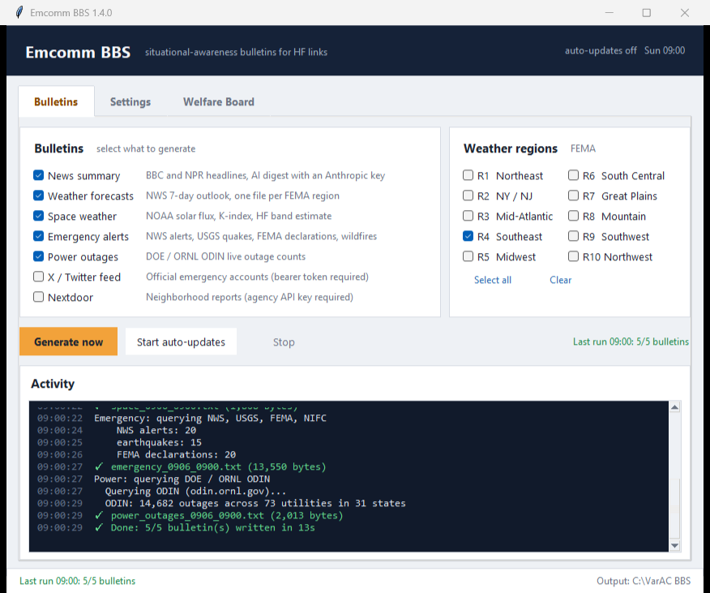
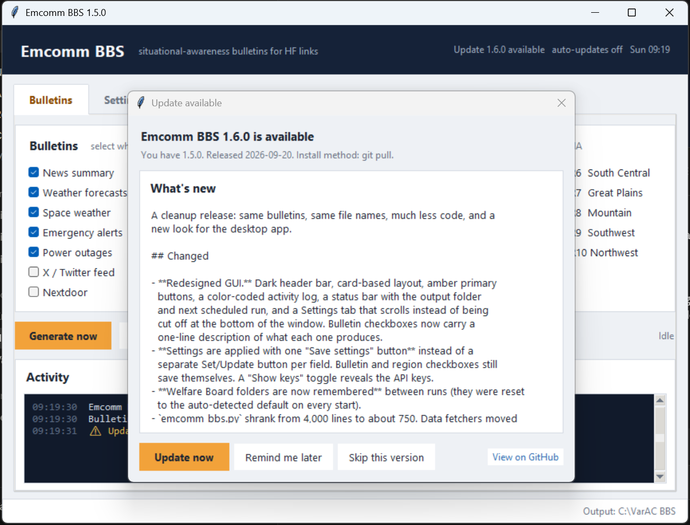
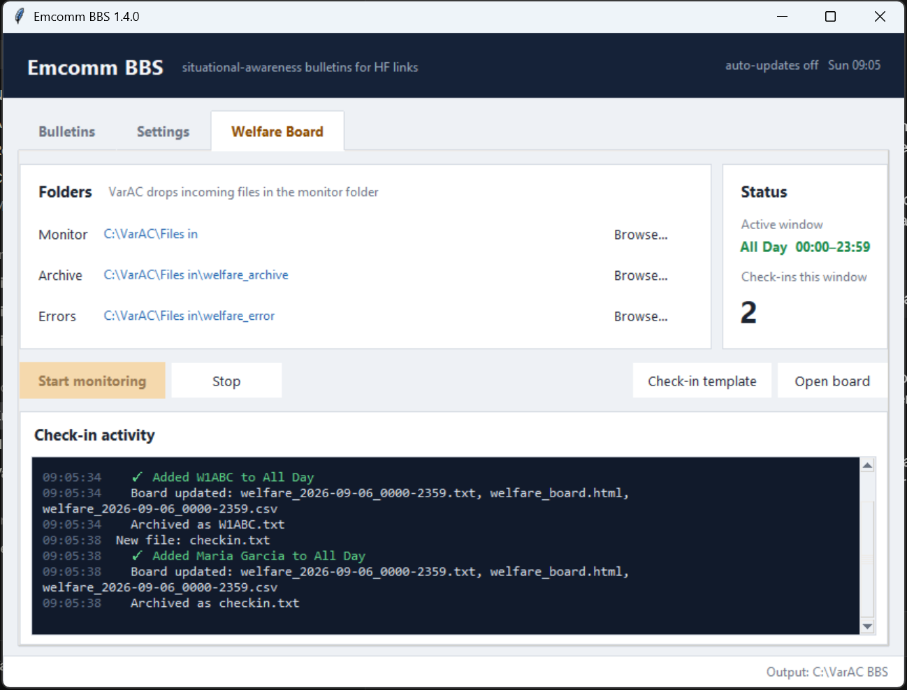

# Emcomm BBS

**A desktop companion for amateur radio emergency communications.** It pulls
situational-awareness data from public sources and renders it as compact
plain-text bulletins sized for low-bandwidth HF links — VarAC, Winlink,
packet — plus a Welfare Board that turns incoming check-in files into a live
roster.

A full set of bulletins is **20–30 KB**, roughly 95% smaller than the
equivalent PDFs.



---

## Modules

| Bulletin | What it gives you | Source |
|---|---|---|
| **News summary** | Top headlines, optionally condensed by Claude | BBC, NPR (RSS) |
| **Weather** | 7-day forecasts for major cities, selectable by FEMA region | NWS |
| **Space weather** | Solar flux, K-index, HF band conditions, 3-day outlook | NOAA SWPC |
| **Emergency alerts** | Active alerts, M4.5+ earthquakes, disaster declarations, largest active wildfires | NWS, USGS, FEMA, NIFC |
| **Power outages** | Live outage counts by state and utility | DOE / ORNL ODIN |
| **X / Twitter feed** | Posts from official emergency accounts | X API v2 |
| **Nextdoor** | Local neighborhood reports (agency API required) | Nextdoor |
| **Welfare Board** | Watches a folder for check-in files, publishes an HTML/TXT/CSV roster | Local files |

Everything except the AI digest, the X feed, and Nextdoor works with **no API
keys at all**.

---

## Quick start — Windows

1. Install [Python 3.8+](https://www.python.org/downloads/) and tick **"Add Python to PATH"**.
2. Download this repository (green **Code** button → **Download ZIP**) and extract it.
3. Double-click **`RUN.bat`**. It installs anything missing and launches the app.
4. Tick the bulletins you want and click **Generate now**.

Bulletins land in `C:\VarAC BBS\` by default — change it on the Settings tab.

## Quick start — Linux / macOS

```bash
chmod +x run_unix.sh
./run_unix.sh
```

## Manual install

```bash
python -m pip install -r requirements.txt
python emcomm_bbs.py
```

On Linux you may also need tkinter: `sudo apt-get install python3-tk`.

---

## Using the app

**Bulletins tab.** Tick what to generate, pick FEMA regions for the weather
files, then either **Generate now** for a one-off run or **Start auto-updates**
to regenerate on the interval set in Settings. The activity log shows every
fetch and the size of each file written. Each new bulletin replaces the
previous one of the same type, so the output folder always holds one current
set.

**Settings tab.** API keys, the output folder, update intervals, and the
Welfare Board check-in windows. Click **Save settings** to apply. Checkboxes
on the Bulletins tab save themselves.

**Welfare Board tab.** Choose the folder VarAC drops incoming files into,
click **Start monitoring**, and open the board in a browser with **Open board**.

Output file names:

```
news_MMDD_HHMM.txt            wx_R4_MMDD_HHMM.txt (one per region)
space_MMDD_HHMM.txt           emergency_MMDD_HHMM.txt
power_outages_MMDD_HHMM.txt   tweets_MMDD_HHMM.txt
nextdoor_MMDD_HHMM.txt        welfare_board.html / welfare_DATE_WINDOW.txt / .csv
```

---

## Updating

The app checks for a new release when it starts (at most once a day) and
tells you in the header and the activity log when one exists. A dialog shows
the release notes with **Update now**, **Remind me later** and **Skip this
version**. You can also use **Check now** on the Settings tab, or turn the
startup check off there.



Updating is one click. If you cloned the repository with git, it runs
`git pull`; if you downloaded a ZIP, it fetches the release and copies the
new files in. Either way:

- `emcomm_bbs_config.json` (your API keys), `settings.json` and `data/` are
  left untouched.
- Every file that gets replaced is kept in `.update-backup/` until the next
  update, so you can roll back by copying it out again.
- `requirements.txt` is reinstalled and the app restarts itself.

If the update cannot complete, the previous version stays in place and the
error is shown. Releases can always be downloaded by hand from
[the releases page](https://github.com/KK4ODA/emcomm-bbs/releases).

---

## Configuration

On first save the app writes **`emcomm_bbs_config.json`** next to the script.
This file holds your API keys and is **excluded from version control** — see
`.gitignore`. To start from a template:

```bash
cp emcomm_bbs_config.example.json emcomm_bbs_config.json
```

| Key | Needed for | Where to get it |
|---|---|---|
| `anthropic_api_key` | AI news digest | [console.anthropic.com](https://console.anthropic.com/) |
| `twitter_token` | X / Twitter feed | X developer portal |
| `nextdoor_key` | Nextdoor reports | Nextdoor agency program |

Leave any of them blank to disable that feature. Without an Anthropic key you
still get plain headline lists.

> **Never commit `emcomm_bbs_config.json`.** If a key ever lands in a commit,
> revoke it at the provider immediately — rewriting history is not enough.

---

## Welfare Board

The Welfare Board watches a folder (typically your VarAC **Files in**
directory) for `.txt` check-in messages, validates them, groups them into
configurable time windows, and publishes a self-refreshing
`welfare_board.html` alongside TXT and CSV versions.

Operators fill out `welfare_checkin_template.txt`:

```
CALLSIGN: W1ABC
NAME: Jane Doe
LOCATION: Springfield, MA
STATUS: SAFE
POWER: ON
CONTACT: 555-123-4567
MESSAGE: All well here, no damage.
```

`CALLSIGN`, `POWER` and `CONTACT` are optional, so non-licensed family
members can check in by name. Valid statuses are `SAFE`, `NEED ASSISTANCE`,
and `TRAFFIC`. A second check-in from the same person with new information
is recorded as an update; an identical one is ignored. See `examples/` for
complete samples and `docs/Emcomm_BBS_User_Guide.txt` for the full walkthrough.

Processed files move to an archive folder; files that fail validation move to
an error folder with a companion `.error.txt` explaining why.



The board can also run on its own, without the bulletin generator:

```bash
python welfare_board.py
```

---

## Repository layout

```
emcomm_bbs.py                  Main GUI application
app_config.py                  Settings file handling and defaults
data_sources.py                NWS, NOAA, news, and ODIN fetchers
emergency_module.py            NWS alerts, USGS, FEMA, wildfire, X feed
nextdoor_module.py             Nextdoor integration
plaintext_generators.py        Compact .txt bulletin formatters
ui_theme.py                    Shared look and feel for both GUIs

welfare_board.py               Standalone Welfare Board GUI
welfare_pipeline.py            Check-in pipeline shared by both GUIs
welfare_parser.py              Check-in file parser
validator.py                   Check-in field validation
aggregator.py                  Time-window grouping and update tracking
output_generator.py            HTML / TXT / CSV board output
file_watcher.py                Directory watcher

emergency_checker.py           Console-only conditions check (no GUI)
tests/                         Offline unit tests

settings.json                  Standalone Welfare Board settings (no secrets)
emcomm_bbs_config.example.json Template for your own config
welfare_checkin_template.txt   Template operators fill out
examples/                      Sample check-in files
docs/                          Full user guide

RUN.bat                        Windows launcher
run_unix.sh                    Linux / macOS launcher
PUSH-TO-GITHUB.bat             Commit and push (see SYNCING.md)
PULL-FROM-GITHUB.bat           Pull the latest from GitHub
```

## Development

```bash
python -m unittest discover -s tests -v
```

The tests run offline; no API keys or network access are needed.

---

## Standalone emergency check

No GUI, prints current conditions to the console:

```bash
python emergency_checker.py        # national
python emergency_checker.py TX     # NWS alerts for one state
```

---

## Data sources and terms

All feeds are public government or public-media sources. Respect their rate
limits and terms of use. This software is provided for amateur radio emergency
communications support — **it is not an official alerting system**. Always
confirm life-safety information through official channels.

## License

GNU General Public License v3.0 — see [LICENSE](LICENSE).

## Author

**KK4ODA** · <https://github.com/KK4ODA>
